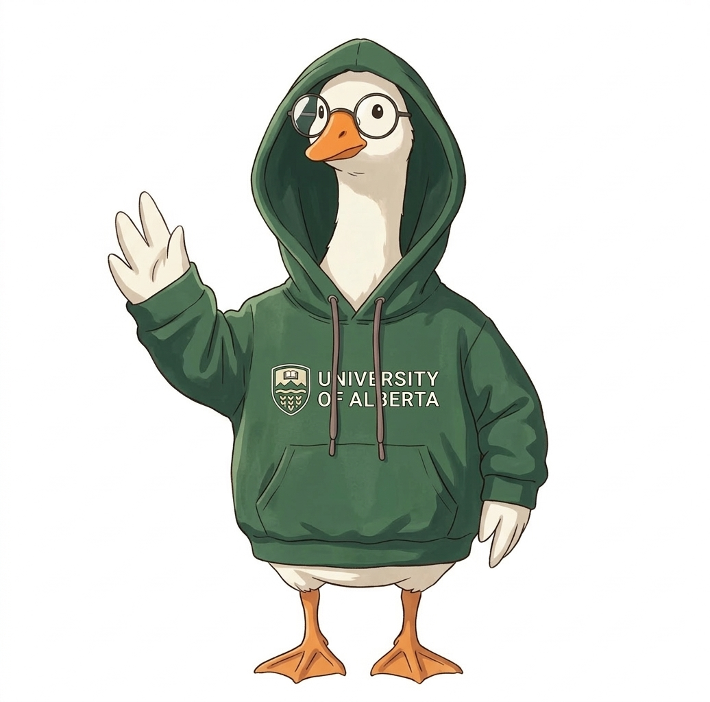

:::: {.lab-page-container}

::: {.lab-main-content}

## Welcome to Goose

We are the **Goose** (GrOup Of Software Engineering) group at [University of Alberta](https://www.ualberta.ca/en/index.html),
working at the intersection of:

- **Foundation Models for Software** — building strong foundation models that can understand and reason about complex software systems at scale
- **SE4AI** — applying and evaluating AI techniques within software engineering workflows

We analyze software artefacts — code, execution traces, bug reports, Q&A posts, and developer networks —
to build automated tools that improve **system reliability**, **developer productivity**, and **security**.

```{=html}
<div id="labCarousel" class="carousel slide lab-carousel" data-bs-ride="carousel">
  <div class="carousel-indicators">
    <button type="button" data-bs-target="#labCarousel" data-bs-slide-to="0" class="active" aria-current="true"></button>
    <button type="button" data-bs-target="#labCarousel" data-bs-slide-to="1"></button>
    <button type="button" data-bs-target="#labCarousel" data-bs-slide-to="2"></button>
  </div>
  <div class="carousel-inner">
    <div class="carousel-item active">
      
    </div>
    <div class="carousel-item">
      
    </div>
  </div>
  <button class="carousel-control-prev" type="button" data-bs-target="#labCarousel" data-bs-slide="prev">
    <span class="carousel-control-prev-icon" aria-hidden="true"></span>
    <span class="visually-hidden">Previous</span>
  </button>
  <button class="carousel-control-next" type="button" data-bs-target="#labCarousel" data-bs-slide="next">
    <span class="carousel-control-next-icon" aria-hidden="true"></span>
    <span class="visually-hidden">Next</span>
  </button>
</div>
```

["Your Lab Motto Here"]{.lab-motto}

::: {.info-row}
::: {.info-item}
[🤝]{.info-icon} **Global Collaborations**

Microsoft Research, Adobe, NUS, NTU, and many more institutions worldwide.
:::

::: {.info-item}
[📄]{.info-icon} **Top-Tier Publications**

ICSE, FSE, ASE, ISSTA · IJCAI, AAAI · IEEE S&P, ESORICS
:::
:::

<div class="join-box">
  🎓 <strong>We are recruiting!</strong> We are looking for passionate PhD students and Research Engineers.<br>
  Contact <a href="mailto:zhou.yang@ualberta.ca">Prof. Zhou Yang</a> for more information.
</div>

:::

::: {.lab-news-sidebar}

### News

::: {.news-list}
- <span class="news-date">[2026.03]</span>  Dr. Zhou Yang win the MSR Outstanding Doctoral Reserch Award🏆! There is only one award this year.
- <span class="news-date">[2026.01]</span> One paper (on automatically protecting critical software operations in TEE) is accepted by **IEEE Transactions on Software Engineering**!
:::

:::

::::

<style>
.lab-page-container {
  display: flex;
  gap: 2rem;
  align-items: flex-start;
  flex-wrap: wrap;
}

.lab-main-content {
  flex: 2;
  min-width: 300px;
}

.lab-news-sidebar {
  flex: 1;
  min-width: 240px;
  max-width: 320px;
  background-color: #f8fafc;
  border-radius: 10px;
  padding: 1.25rem;
  border: 1px solid #e2e8f0;
  position: sticky;
  top: 80px;
}

.news-date {
  color: #e53e3e;
  font-weight: 600;
}

.lab-news-sidebar h3 {
  font-size: 1.1rem;
  font-weight: 700;
  border-bottom: 2px solid #2563eb;
  padding-bottom: 0.5rem;
  margin-bottom: 1rem;
}


.lab-motto {
  text-align: center;
  font-style: italic;
  color: #64748b;
  margin: 0.5rem 0 1.5rem;
}

.info-row {
  display: flex;
  gap: 1rem;
  flex-wrap: wrap;
  margin: 1.25rem 0;
}

.info-item {
  flex: 1;
  min-width: 220px;
  background: #f8fafc;
  border: 1px solid #e2e8f0;
  border-radius: 8px;
  padding: 0.9rem 1rem;
  font-size: 0.9rem;
}

.info-item p {
  margin: 0;
}

.info-icon {
  font-size: 1.4rem;
  line-height: 1.3;
}

.join-box {
  background-color: #fffbeb;
  border: 1px solid #fcd34d;
  border-left: 4px solid #f59e0b;
  border-radius: 8px;
  padding: 0.9rem 1.1rem;
  font-size: 0.95rem;
  margin-top: 1.5rem;
  line-height: 1.7;
}

.lab-carousel {
  margin: 1.5rem 0;
  border-radius: 10px;
  overflow: hidden;
  box-shadow: 0 4px 12px rgba(0,0,0,0.1);
}

.lab-carousel .carousel-item img {
  width: 100%;
  height: auto;
}

@media (max-width: 768px) {
  .lab-page-container {
    flex-direction: column;
  }
  .lab-news-sidebar {
    max-width: 100%;
    position: static;
  }
}
</style>