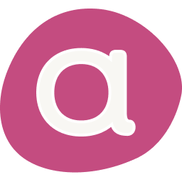

:::: {.lab-page-container}

::: {.lab-main-content}

## Welcome to Goose

We are the **U-a-Goose** <span class="goose-acronym">(<span class="goose-letter">G</span>r<span class="goose-letter">O</span>up <span class="goose-letter">O</span>f <span class="goose-letter">S</span>oftware <span class="goose-letter">E</span>ngineering)</span> group at [University of Alberta](https://www.ualberta.ca/en/index.html).

::: {.lab-intro-grid}

::: {.lab-image-card}
```{=html}
<div class="lab-image">
  
</div>
```
:::

::: {.lab-copy-card}
### What We Work On

U-A-Goose studies **trustworthy software engineering for the AI era**, with a particular focus on **large language models for code**, **AI security and privacy**, and **efficient and sustainable AI systems**.

Our projects sit at the intersection of software engineering and machine learning: robust coding assistants, evaluation and testing of AI-enabled systems, automated protection of critical software operations, specification-driven development, and emerging systems topics such as game compatibility layers.

```{=html}
<div class="lab-tag-row">
  <span class="lab-tag">Trustworthy Code LLMs</span>
  <span class="lab-tag">AI Security &amp; Privacy</span>
  <span class="lab-tag">Software Engineering</span>
  <span class="lab-tag">Efficient AI Systems</span>
</div>
```
:::

:::

::: {.lab-affiliation-card}
### UAlberta × Amii

Our group is based in the **Department of Computing Science at the University of Alberta**. Prof. Zhou Yang is an **Amii Fellow**, and the lab is connected to the **Amii** research ecosystem through collaborative projects and Amii-supported initiatives, including the recently approved **Amii RAP** funding.
:::

<!-- ["Your Lab Motto Here"]{.lab-motto} -->

<!-- ::: {.info-row}
::: {.info-item}
[🤝]{.info-icon} **Global Collaborations**

Microsoft Research, Adobe, NUS, NTU, and many more institutions worldwide.
:::

::: {.info-item}
[📄]{.info-icon} **Top-Tier Publications**

ICSE, FSE, ASE, ISSTA · IJCAI, AAAI · IEEE S&P, ESORICS
:::
::: -->

<!-- <div class="join-box">
  🎓 <strong>We are recruiting!</strong> We are looking for passionate PhD students and Research Engineers.<br>
  Contact <a href="mailto:zhou.yang@ualberta.ca">Prof. Zhou Yang</a> for more information.
</div> -->

:::

::: {.lab-news-sidebar}

### News

::: {.news-list}
- <span class="news-date">[2026.04]</span> Our paper, MultiCodeAttack: Iterative Jailbreak Attacking on LLMs with Multi-Code Prompt Injection, is accepted by **ACL 2026**!
- <span class="news-date">[2026.04]</span> My NSERC Discovery Grant has been approved! Grateful for the support to advance our research.
- <span class="news-date">[2026.03]</span> Dr. Zhou Yang's Amii RAP funding (2026 to 2027) 💰 is approved, collaborating with [Matt Taylor](https://drmatttaylor.net/).
- <span class="news-date">[2026.03]</span> One paper on efficient code LLM inference with quantization and compilation-time optimization is accepted by **FSE 2026**.
- <span class="news-date">[2026.03]</span> Hanzheng Dai's doctoral symposium paper on "Automated Diagnosis and Testing of Game Compatibility Layers" is accepted by **FSE 2026 Doctoral Symposium**.
- <span class="news-date">[2026.03]</span> Dr. Zhou Yang wins the **MSR Outstanding Doctoral Research Award**🏆! There is only one awardee this year.
- <span class="news-date">[2026.01]</span> One paper (on automatically protecting critical software operations in TEE) is accepted by **IEEE Transactions on Software Engineering**!
- <span class="news-date">[2025.12]</span> Dr. Zhou Yang wins the **ACM SIGSOFT Outstanding Doctoral Dissertation Award**🏆! There is only one award this year.
- <span class="news-date">[2025.11]</span> Our paper on understanding user perceptions of AI coding assistants wins the **Distinguished Paper Award**🏆 at **ASE 2025**!
- <span class="news-date">[2025.09]</span> Our paper wins the prestigious **2024 IEEE Computer Society Best Paper Award**🏆! (1 out of 183)
- <span class="news-date">[2025.09]</span> Dr. Zhou Yang officially joins the University of Alberta as an Assistant Professor and becomes an **Amii Fellow**.
:::

:::

::::

```{=html}
<section class="home-bento-band">
  <div class="home-bento-grid">
    <a class="home-bento-card home-bento-link" href="publications.html">
      <span class="home-bento-eyebrow">Research</span>
      <h3>Publications</h3>
      <p>
        Explore our work across venues including <strong>ICSE</strong>, <strong>FSE</strong>, <strong>ASE</strong>, <strong>TOSEM</strong>, and <strong>TSE</strong>.
      </p>
      <span class="home-bento-cta">Browse papers →</span>
    </a>

    <a class="home-bento-card home-bento-link" href="team.html">
      <span class="home-bento-eyebrow">People</span>
      <h3>Group Members</h3>
      <p>
        Meet Prof. Zhou Yang and our growing team of graduate researchers working on software engineering, AI systems, and trustworthy code LLMs.
      </p>
      <span class="home-bento-cta">Meet the team →</span>
    </a>

    <a class="home-bento-card home-bento-link" href="vacancy.html">
      <span class="home-bento-eyebrow">Join Us</span>
      <h3>Vacancy</h3>
      <p>
        We welcome strong applicants interested in PhD, research assistant, and undergraduate individual study opportunities in software engineering and AI.
      </p>
      <span class="home-bento-cta">See openings →</span>
    </a>

    <section class="home-bento-card home-bento-highlight">
      <span class="home-bento-eyebrow">2026 Highlights</span>
      <h3>Join Our Community Events</h3>
      <p>
        We are helping build and support research communities around software engineering, human-centered AI, and trustworthy code LLMs. We encourage researchers and students to participate.
      </p>

      <div class="event-stack">
        <a class="event-pill" href="https://www.cser.ca/2026s/" target="_blank" rel="noopener noreferrer">
          <strong>CSER 2026 Spring</strong>
          <span>May 23-24, 2026 · University of Alberta, Edmonton</span>
        </a>
        <a class="event-pill" href="https://humanai4se.github.io/" target="_blank" rel="noopener noreferrer">
          <strong>HumanAISE 2026</strong>
          <span>2nd Workshop on Human-Centered AI for Software Engineering · Co-located with FSE 2026 in Montreal</span>
        </a>
        <a class="event-pill" href="https://poisonedchalice.github.io/" target="_blank" rel="noopener noreferrer">
          <strong>Poisoned Chalice Competition 2026</strong>
          <span>Co-located with FSE 2026 · Competition day: July 6, 2026 · Montreal</span>
        </a>
      </div>

      <p class="home-bento-note">
        Please check the official pages above for the latest registration, program, and participation details.
      </p>
    </section>
  </div>
</section>
```

```{=html}
<section class="funding-strip">
  <h3>Funding &amp; Institutional Support</h3>
  <p>
    Our work is supported by research funders and institutional partners including the following organizations.
  </p>
  <div class="funding-grid">
    <a class="funder-card" href="https://www.amii.ca/" target="_blank" rel="noopener noreferrer">
      
      <span class="funder-name">Amii</span>
    </a>
    <a class="funder-card" href="https://cifar.ca/" target="_blank" rel="noopener noreferrer">
      
      <span class="funder-name">CIFAR</span>
    </a>
    <a class="funder-card" href="https://www.ualberta.ca/en/index.html" target="_blank" rel="noopener noreferrer">
      
      <span class="funder-name">University of Alberta</span>
    </a>
    <a class="funder-card" href="https://nserc-crsng.canada.ca/en" target="_blank" rel="noopener noreferrer">
      
      <span class="funder-name">NSERC</span>
    </a>
  </div>
</section>
```

<style>
.lab-page-container {
  display: flex;
  gap: 2rem;
  align-items: flex-start;
  flex-wrap: wrap;
  margin-bottom: 2rem;
}

.lab-main-content {
  flex: 1 1 0;
  min-width: 0;
  width: 100%;
}

.lab-intro-grid {
  display: grid;
  grid-template-columns: minmax(260px, 0.9fr) minmax(300px, 1.25fr);
  gap: 1.25rem;
  margin: 1.5rem 0 1.15rem;
  align-items: stretch;
}

.lab-image-card,
.lab-copy-card,
.lab-affiliation-card {
  background: linear-gradient(180deg, #ffffff 0%, #f8fbff 100%);
  border: 1px solid #e2e8f0;
  border-radius: 18px;
  box-shadow: 0 14px 30px rgba(15, 23, 42, 0.08);
  min-width: 0;
}

.lab-image-card {
  padding: 1rem;
}

.lab-copy-card,
.lab-affiliation-card {
  padding: 1.3rem 1.4rem;
}

.lab-copy-card h3,
.lab-affiliation-card h3 {
  margin-top: 0;
  margin-bottom: 0.7rem;
  font-size: 1.08rem;
  font-weight: 700;
}

.lab-copy-card p:last-child,
.lab-affiliation-card p:last-child {
  margin-bottom: 0;
}

.lab-tag-row {
  display: flex;
  flex-wrap: wrap;
  gap: 0.55rem;
  margin-top: 1rem;
}

.lab-tag {
  display: inline-flex;
  align-items: center;
  padding: 0.42rem 0.7rem;
  border-radius: 999px;
  background: #e8f1ff;
  color: #1d4ed8;
  font-size: 0.82rem;
  font-weight: 600;
  line-height: 1;
}

.goose-acronym {
  white-space: nowrap;
}

.goose-letter {
  display: inline-block;
  font-size: 1.08em;
  font-weight: 700;
  text-decoration: underline;
  text-underline-offset: 0.1em;
  text-decoration-thickness: 0.08em;
}

.lab-affiliation-card {
  margin-bottom: 1rem;
}

.home-bento-band {
  width: 100%;
  margin: 0 0 2.2rem;
}

.home-bento-grid {
  display: grid;
  grid-template-columns: repeat(3, minmax(0, 1fr));
  gap: 1rem;
}

.home-bento-card {
  border-radius: 18px;
  border: 1px solid #dbe4f0;
  background: linear-gradient(180deg, #ffffff 0%, #f8fbff 100%);
  box-shadow: 0 14px 32px rgba(15, 23, 42, 0.08);
  padding: 1.3rem 1.35rem;
}

.home-bento-link {
  text-decoration: none;
  color: inherit;
  transition: transform 0.2s ease, box-shadow 0.2s ease, border-color 0.2s ease;
}

.home-bento-link:hover {
  transform: translateY(-3px);
  border-color: #93c5fd;
  box-shadow: 0 16px 28px rgba(37, 99, 235, 0.12);
}

.home-bento-highlight {
  grid-column: 1 / -1;
  background:
    radial-gradient(circle at top right, rgba(96, 165, 250, 0.16), transparent 28%),
    linear-gradient(135deg, #f7fbff 0%, #eef5ff 100%);
}

.home-bento-eyebrow {
  display: inline-flex;
  margin-bottom: 0.65rem;
  padding: 0.34rem 0.62rem;
  border-radius: 999px;
  background: #e8f1ff;
  color: #1d4ed8;
  font-size: 0.77rem;
  font-weight: 700;
  letter-spacing: 0.02em;
  text-transform: uppercase;
}

.home-bento-card h3 {
  margin: 0 0 0.6rem;
  font-size: 1.15rem;
  font-weight: 700;
}

.home-bento-card p {
  margin: 0;
  color: #475569;
}

.home-bento-cta {
  display: inline-block;
  margin-top: 1.1rem;
  font-weight: 700;
  color: #2563eb;
}

.event-stack {
  display: grid;
  grid-template-columns: repeat(3, minmax(0, 1fr));
  gap: 0.9rem;
  margin-top: 1.2rem;
}

.event-pill {
  display: flex;
  min-height: 128px;
  flex-direction: column;
  justify-content: space-between;
  gap: 0.7rem;
  padding: 1rem;
  border-radius: 16px;
  border: 1px solid #d5e2f0;
  background: rgba(255, 255, 255, 0.9);
  color: inherit;
  text-decoration: none;
  transition: transform 0.2s ease, border-color 0.2s ease, box-shadow 0.2s ease;
}

.event-pill:hover {
  transform: translateY(-3px);
  border-color: #60a5fa;
  box-shadow: 0 12px 24px rgba(37, 99, 235, 0.12);
}

.event-pill strong {
  color: #0f172a;
  font-size: 1rem;
}

.event-pill span {
  color: #475569;
  font-size: 0.92rem;
  line-height: 1.5;
}

.home-bento-note {
  margin-top: 1rem !important;
  font-size: 0.92rem;
}

.lab-news-sidebar {
  flex: 0 1 420px;
  min-width: 300px;
  max-width: 420px;
  width: 100%;
  background-color: #f8fafc;
  border-radius: 10px;
  padding: 1.25rem;
  border: 1px solid #e2e8f0;
  position: sticky;
  top: 80px;
  max-height: calc(100vh - 100px);
  display: flex;
  flex-direction: column;
}

.news-list {
  flex: 1 1 auto;
  min-height: 0;
  overflow-y: auto;
  padding-right: 0.35rem;
  scrollbar-gutter: stable;
}

.news-date {
  color: #e53e3e;
  font-weight: 600;
}

.lab-news-sidebar h3 {
  font-size: 1.1rem;
  font-weight: 700;
  border-bottom: 2px solid #2563eb;
  padding-bottom: 0.5rem;
  margin-bottom: 1rem;
}

.news-list::-webkit-scrollbar {
  width: 8px;
}

.news-list::-webkit-scrollbar-thumb {
  background: #cbd5e1;
  border-radius: 999px;
}

.news-list::-webkit-scrollbar-track {
  background: transparent;
}


.lab-motto {
  text-align: center;
  font-style: italic;
  color: #64748b;
  margin: 0.5rem 0 1.5rem;
}

.info-row {
  display: flex;
  gap: 1rem;
  flex-wrap: wrap;
  margin: 1.25rem 0;
}

.info-item {
  flex: 1;
  min-width: 220px;
  background: #f8fafc;
  border: 1px solid #e2e8f0;
  border-radius: 8px;
  padding: 0.9rem 1rem;
  font-size: 0.9rem;
}

.info-item p {
  margin: 0;
}

.info-icon {
  font-size: 1.4rem;
  line-height: 1.3;
}

.join-box {
  background-color: #fffbeb;
  border: 1px solid #fcd34d;
  border-left: 4px solid #f59e0b;
  border-radius: 8px;
  padding: 0.9rem 1.1rem;
  font-size: 0.95rem;
  margin-top: 1.5rem;
  line-height: 1.7;
}

.lab-image {
  border-radius: 10px;
  overflow: hidden;
  background: linear-gradient(135deg, #f8fafc 0%, #eef4ff 100%);
}

.lab-image img {
  width: 100%;
  height: auto;
  display: block;
}

@media (max-width: 1280px) {
  .lab-intro-grid {
    grid-template-columns: 1fr;
  }
  .home-bento-grid {
    grid-template-columns: repeat(2, minmax(0, 1fr));
  }
  .home-bento-highlight {
    grid-column: 1 / -1;
  }
}

@media (max-width: 768px) {
  .home-bento-grid {
    grid-template-columns: 1fr;
  }
  .event-stack {
    grid-template-columns: 1fr;
  }
}

@media (max-width: 1100px) {
  .lab-page-container {
    flex-direction: column;
  }
  .lab-news-sidebar {
    max-width: 100%;
    position: static;
    max-height: none;
  }
  .news-list {
    overflow: visible;
    padding-right: 0;
  }
}
</style>
