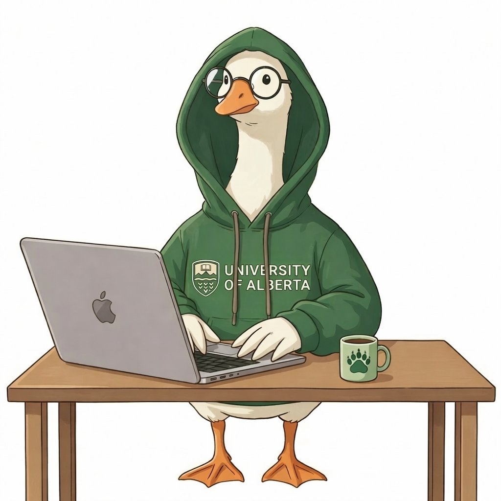

:::: {.lab-page-container}

::: {.lab-main-content}

## Welcome to Goose

We are the **U-a-Goose** (GrOup Of Software Engineering) group at [University of Alberta](https://www.ualberta.ca/en/index.html).

```{=html}
<div class="lab-image">
  
</div>
```

<!-- ["Your Lab Motto Here"]{.lab-motto} -->

<!-- ::: {.info-row}
::: {.info-item}
[🤝]{.info-icon} **Global Collaborations**

Microsoft Research, Adobe, NUS, NTU, and many more institutions worldwide.
:::

::: {.info-item}
[📄]{.info-icon} **Top-Tier Publications**

ICSE, FSE, ASE, ISSTA · IJCAI, AAAI · IEEE S&P, ESORICS
:::
::: -->

<!-- <div class="join-box">
  🎓 <strong>We are recruiting!</strong> We are looking for passionate PhD students and Research Engineers.<br>
  Contact <a href="mailto:zhou.yang@ualberta.ca">Prof. Zhou Yang</a> for more information.
</div> -->

:::

::: {.lab-news-sidebar}

### News

::: {.news-list}
- <span class="news-date">[2026.03]</span> Dr. Zhou Yang's Amii RAP funding (2026 to 2027) 💰 is approved, collaborating with [Matt Taylor](https://drmatttaylor.net/).
- <span class="news-date">[2026.03]</span> One paper on efficient code LLM inference with quantization and compilation-time optimization is accepted by **FSE 2026**.
- <span class="news-date">[2026.03]</span> Hanzheng Dai's doctoral symposium paper on "Automated Diagnosis and Testing of Game Compatibility Layers" is accepted by **FSE 2026 Doctoral Symposium**.
- <span class="news-date">[2026.03]</span> Dr. Zhou Yang wins the **MSR Outstanding Doctoral Research Award**🏆! There is only one awardee this year.
- <span class="news-date">[2026.01]</span> One paper (on automatically protecting critical software operations in TEE) is accepted by **IEEE Transactions on Software Engineering**!
- <span class="news-date">[2025.12]</span> Dr. Zhou Yang wins the **ACM SIGSOFT Outstanding Doctoral Dissertation Award**🏆! There is only one award this year.
- <span class="news-date">[2025.11]</span> Our paper on understanding user perceptions of AI coding assistants wins the **Distinguished Paper Award**🏆 at **ASE 2025**!
- <span class="news-date">[2025.09]</span> Our paper wins the prestigious **2024 IEEE Computer Society Best Paper Award**🏆! (1 out of 183)
- <span class="news-date">[2025.09]</span> Dr. Zhou Yang officially joins the University of Alberta as an Assistant Professor and becomes an **Amii Fellow**.
:::

:::

::::

<style>
.lab-page-container {
  display: flex;
  gap: 2rem;
  align-items: flex-start;
  flex-wrap: wrap;
}

.lab-main-content {
  flex: 2;
  min-width: 300px;
}

.lab-news-sidebar {
  flex: 0 1 380px;
  min-width: 280px;
  max-width: 380px;
  background-color: #f8fafc;
  border-radius: 10px;
  padding: 1.25rem;
  border: 1px solid #e2e8f0;
  position: sticky;
  top: 80px;
  max-height: calc(100vh - 100px);
  display: flex;
  flex-direction: column;
}

.news-list {
  flex: 1 1 auto;
  min-height: 0;
  overflow-y: auto;
  padding-right: 0.35rem;
  scrollbar-gutter: stable;
}

.news-date {
  color: #e53e3e;
  font-weight: 600;
}

.lab-news-sidebar h3 {
  font-size: 1.1rem;
  font-weight: 700;
  border-bottom: 2px solid #2563eb;
  padding-bottom: 0.5rem;
  margin-bottom: 1rem;
}

.news-list::-webkit-scrollbar {
  width: 8px;
}

.news-list::-webkit-scrollbar-thumb {
  background: #cbd5e1;
  border-radius: 999px;
}

.news-list::-webkit-scrollbar-track {
  background: transparent;
}


.lab-motto {
  text-align: center;
  font-style: italic;
  color: #64748b;
  margin: 0.5rem 0 1.5rem;
}

.info-row {
  display: flex;
  gap: 1rem;
  flex-wrap: wrap;
  margin: 1.25rem 0;
}

.info-item {
  flex: 1;
  min-width: 220px;
  background: #f8fafc;
  border: 1px solid #e2e8f0;
  border-radius: 8px;
  padding: 0.9rem 1rem;
  font-size: 0.9rem;
}

.info-item p {
  margin: 0;
}

.info-icon {
  font-size: 1.4rem;
  line-height: 1.3;
}

.join-box {
  background-color: #fffbeb;
  border: 1px solid #fcd34d;
  border-left: 4px solid #f59e0b;
  border-radius: 8px;
  padding: 0.9rem 1.1rem;
  font-size: 0.95rem;
  margin-top: 1.5rem;
  line-height: 1.7;
}

.lab-image {
  margin: 1.5rem 0;
  border-radius: 10px;
  overflow: hidden;
  box-shadow: 0 4px 12px rgba(0,0,0,0.1);
}

.lab-image img {
  width: 100%;
  height: auto;
  display: block;
}

@media (max-width: 768px) {
  .lab-page-container {
    flex-direction: column;
  }
  .lab-news-sidebar {
    max-width: 100%;
    position: static;
    max-height: none;
  }
  .news-list {
    overflow: visible;
    padding-right: 0;
  }
}
</style>
