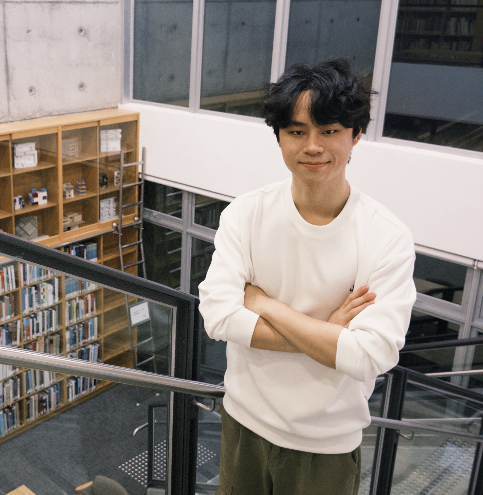
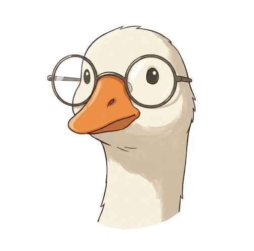

## Principal Investigator

```{=html}
<section class="team-shell">
  <div class="team-panel team-pi-card">
    <div class="team-pi-photo-wrap">
      
    </div>
    <div class="team-pi-body">
      <span class="team-eyebrow">Principal Investigator</span>
      <h3>Prof. Zhou Yang</h3>
      <p class="team-role">Assistant Professor at the University of Alberta · Amii Fellow</p>
      <p>
        Zhou Yang is an Assistant Professor in the Department of Computing Science at the University of Alberta and an Amii Fellow. He completed his Ph.D. at Singapore Management University in December 2024, after earning an MSc from University College London. He previously served as a senior research engineer at the Centre for Research on Intelligent Software Engineering.
      </p>
      <p>
        His research establishes scientific and practical foundations for trustworthy code LLMs, integrating robustness, security, privacy, ecosystem understanding, and efficiency to support safer AI adoption in software engineering. He has received multiple major awards, including the 2026 MSR Outstanding Doctoral Research Award, the 2025 ACM SIGSOFT Outstanding Doctoral Dissertation Award, and the 2024 IEEE Computer Society Best Paper Award.
      </p>
      <p class="team-links">
        <a href="mailto:zy25@ualberta.ca">Email</a>
        <a href="https://scholar.google.com/citations?user=4oWBhPsAAAAJ&hl=en">Google Scholar</a>
        <a href="https://homepage.zhouyang.me/">Homepage</a>
      </p>
    </div>
  </div>
</section>
```

## PhD Students

```{=html}
<section class="team-shell">
  <div class="team-member-grid">
    <article class="team-panel team-member-card">
      
      <div class="team-member-body">
        <span class="team-eyebrow">PhD Student</span>
        <h3>Hanzheng (Hozier) Dai</h3>
        <p class="team-role">
          <span>PhD Student, CS Department</span>
          <span>Joined Jan 2026</span>
        </p>

        <p class="team-links">
          <a href="mailto:hanzhen3@ualberta.ca">Email</a>
          <a href="https://hozierddd.github.io/">Homepage</a>
        </p>
      </div>
    </article>

    <article class="team-panel team-member-card">
      
      <div class="team-member-body">
        <span class="team-eyebrow">Incoming</span>
        <h3>Ming Melvin Wang</h3>
        <p class="team-role">
          <span>PhD Student, CS Department</span>
          <span>Incoming (Sep 2026)</span>
        </p>

        <p class="team-links">
          <a href="https://melvin-king.github.io/">Homepage</a>
        </p>
      </div>
    </article>

    <article class="team-panel team-member-card">
      
      <div class="team-member-body">
        <span class="team-eyebrow">Incoming</span>
        <h3>Wenjia Jiang</h3>
        <p class="team-role">
          <span>PhD Student, CS Department</span>
          <span>Incoming (Sep 2026)</span>
        </p>

        <p class="team-links">
          <a href="https://jwj1342.github.io/">Homepage</a>
        </p>
      </div>
    </article>

    <article class="team-panel team-member-card">
      
      <div class="team-member-body">
        <span class="team-eyebrow">Incoming</span>
        <h3>Geng He</h3>
        <p class="team-role">
          <span>PhD Student, CS Department</span>
          <span>Incoming (Sep 2026)</span>
        </p>
      </div>
    </article>

    <article class="team-panel team-member-card">
      
      <div class="team-member-body">
        <span class="team-eyebrow">Incoming</span>
        <h3>Jingfeng Jiang</h3>
        <p class="team-role">
          <span>PhD Student, CS Department</span>
          <span>Incoming (Sep 2026)</span>
        </p>
      </div>
    </article>
  </div>
</section>
```

## MSc Students

```{=html}
<section class="team-shell">
  <div class="team-member-grid">
    <article class="team-panel team-member-card">
      
      <div class="team-member-body">
        <span class="team-eyebrow">Incoming</span>
        <h3>Tanzim Hossain Romel</h3>
        <p class="team-role">
          <span>MSc Student, CS Department</span>
          <span>Incoming (Sep 2026)</span>
        </p>
        <p class="team-links">
          <a href="https://tanzimhromel.com">Homepage</a>
        </p>
      </div>
    </article>
  </div>
</section>
```

## Visitors & RAs

```{=html}
<section class="team-shell">
  <div class="team-member-grid">
    <article class="team-panel team-member-card">
      
      <div class="team-member-body">
        <span class="team-eyebrow">MEng Student</span>
        <h3>Zixi Chai</h3>
        <p class="team-role">
          <span>MEng Student, ECE Department</span>
          <span>Joined Jan 2026</span>
        </p>

        <p class="team-links">
          <a href="mailto:zchai3@ualberta.ca">Email</a>
        </p>
      </div>
    </article>
    
    <article class="team-panel team-member-card">
      
      <div class="team-member-body">
        <span class="team-eyebrow">MEng Student</span>
        <h3>Jiaxuan Tong</h3>
        <p class="team-role">
          <span>MEng Student, ECE Department</span>
          <span>Joined March 2026</span>
        </p>
        
        <p class="team-links">
          <a href="mailto:jtong11@ualberta.ca">Email</a>
        </p>
      </div>
    </article>

    <article class="team-panel team-member-card">
      
      <div class="team-member-body">
        <span class="team-eyebrow">Visiting Student</span>
        <h3>Xingan Gao</h3>
        <p class="team-role">
          <span>Visiting Student, Yangzhou University</span>
          <span>Incoming (Sep 2026)</span>
        </p>
      </div>
    </article>
  </div>

  <div class="team-panel team-join-card">
    <div>
      <span class="team-eyebrow">Join Us</span>
      <h3>Interested in Joining the Group?</h3>
      <p>
        We welcome strong students interested in software engineering, trustworthy AI, and code LLM research.
      </p>
    </div>
    <p class="team-links">
      <a href="vacancy.html">View openings</a>
    </p>
  </div>
</section>
```
